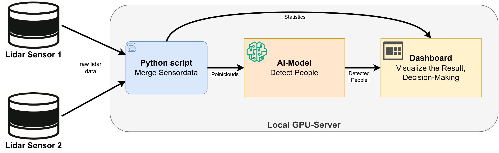
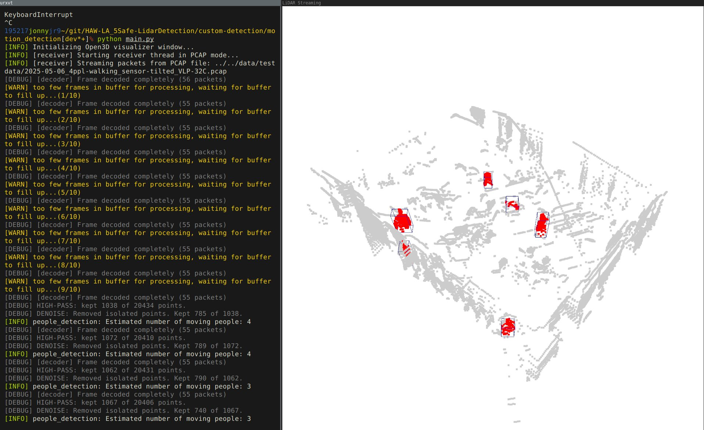
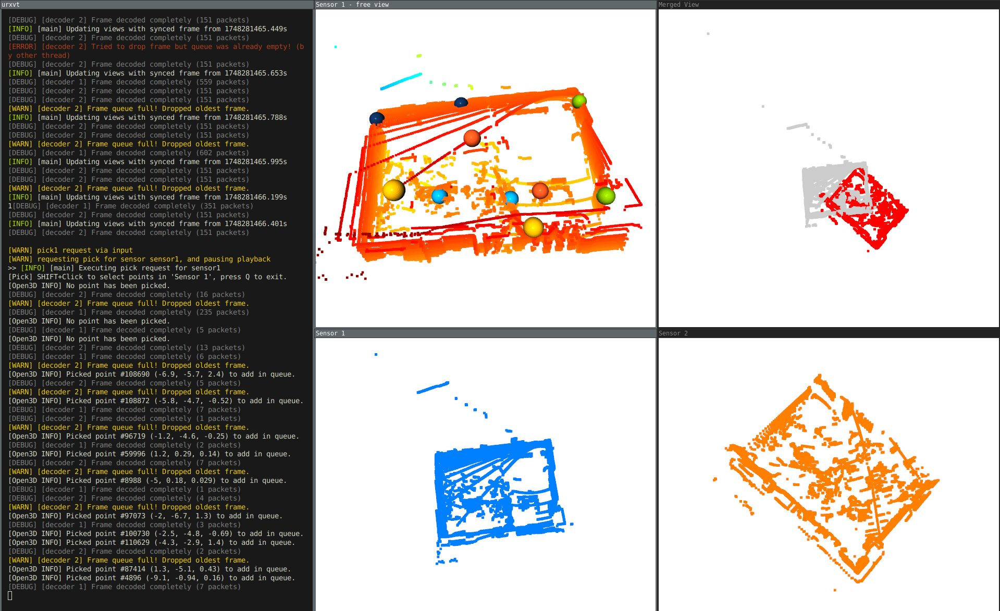
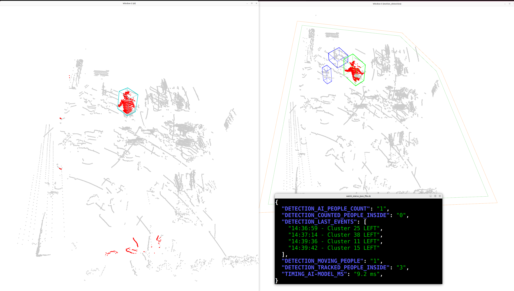
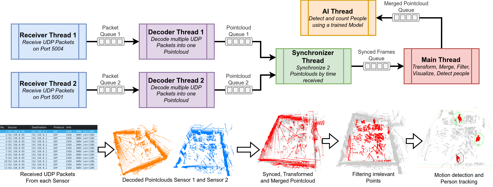
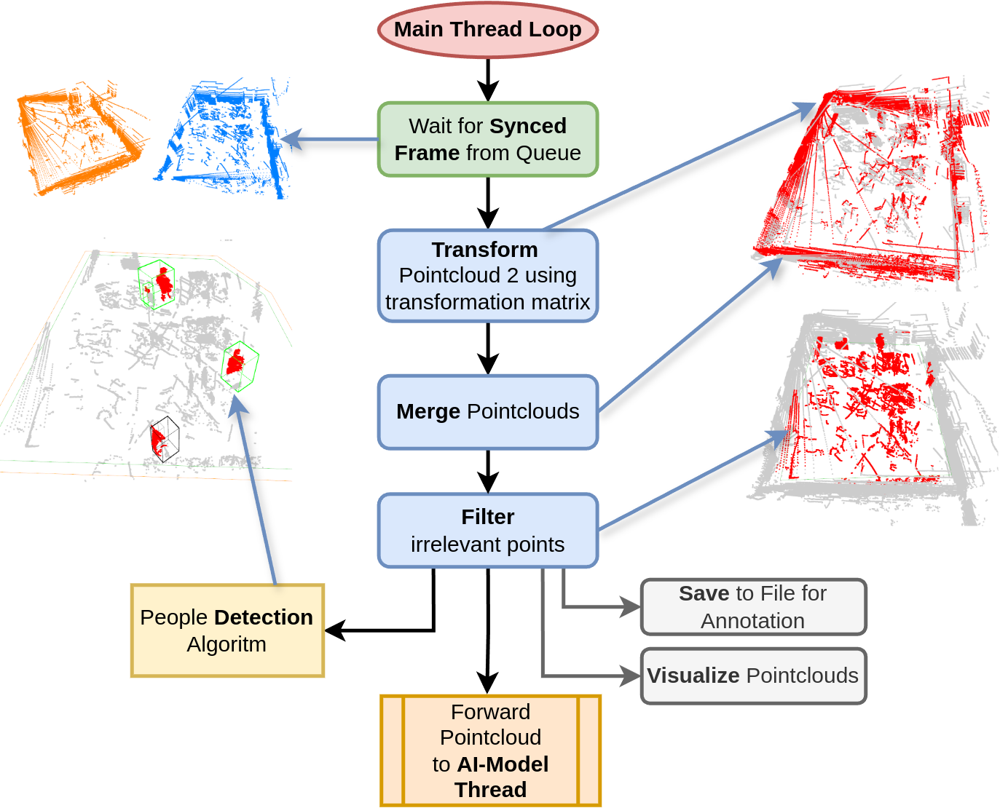
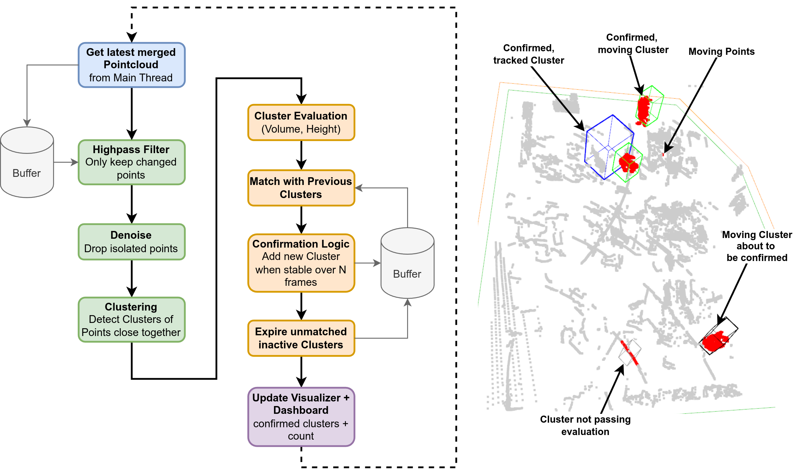
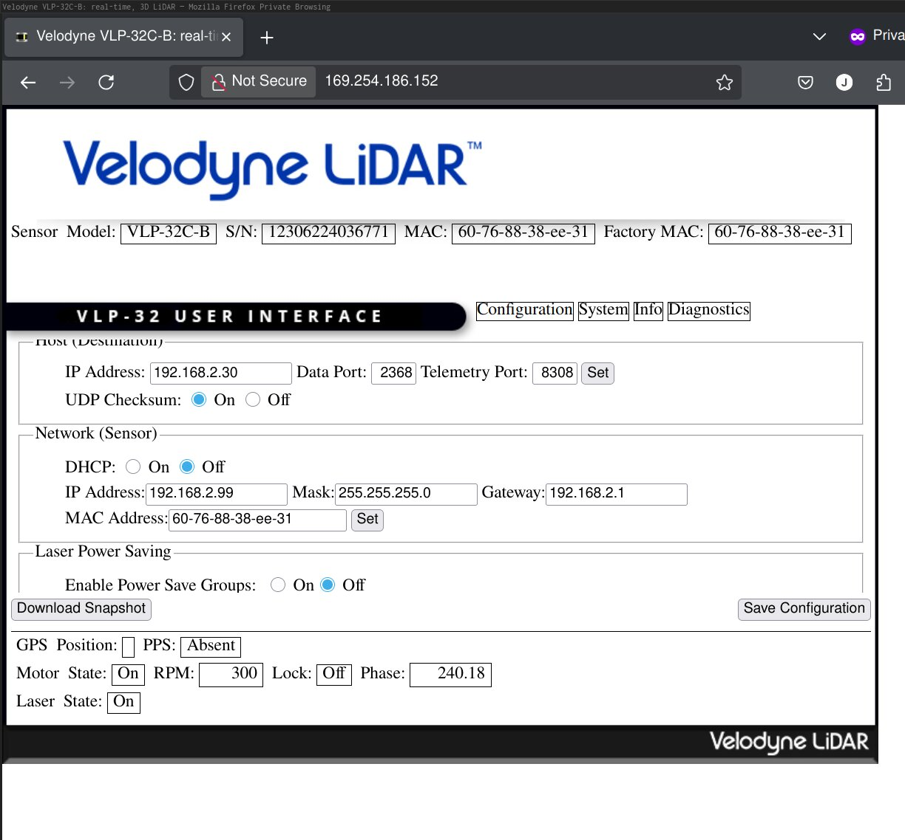
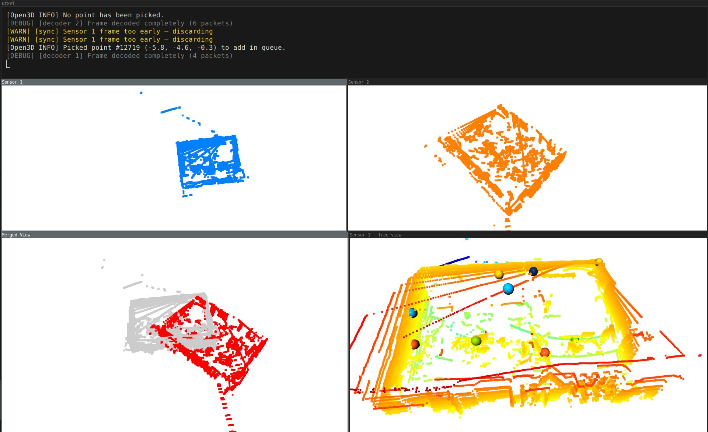

# 5Safe Lidar Room-Scale LiDAR People Detection – HAW-LA

This repository contains the full system for **5Safe Room-Scale LiDAR Detection**, developed in the **IoT Project module** at **HAW Landshut** during the summer semester 2025.

It is loosely inspired by the original *5Safe* project, which focused on outdoor/street-level LiDAR detection. Our version is an independent system tailored for **indoor room-scale environments**, using the same class of 3D LiDAR sensors in a dual-sensor setup.  
<br>

The Idea was to explore two detection strategies:
- An AI-based approach
- A custom detection method based on a simple algorithm for motion analysis

---

# System Overview

The core of this repository is the `lidar_system/` Python project. It integrates all key components:

- Real-time processing of LiDAR data from 2 sensors (UDP Streams)
- Merging of sensor views using transformation matrices
- Algorithms for detecting people
  - Motion-based: detect moving points, use clustering and filtering, track where people are even when no longer moving
  - Change-based: compare new points to reference dataset, clustering and analysing the shape
- AI-based people detection
  - Integrated AI-based bounding box detection using PointNet
- Live visualization via Open3D (multiple synchronized windows, easily configurable what stage is shown in which window)
- TCP streaming the results for dashboards or external consumers
- Creation of a `status.json` file (output and debug variables for a simplified dashboard)
- Utilities for cropping, picking points, and exporting results

### Architecture Overview



---

## Screenshots and Visual Results

| Motion Detection (First stage) | Dual Sensor Merge (process to get the transformation matrix) |
|---------------------------|-------------------|
|  |  |

| AI vs. Algorithm Comparison |
|-----------------------------|
|  |

---

# Repository Structure

```
lidar_system/              ← Main Python system (core logic, live detection)
data/                      ← Test recordings (.pcap, .mp4)
ai-detection/              ← AI experiments and detection (e.g. PointNet)
dashboard/                 ← TCP dashboard receiver examples
scripts/                   ← Utilities (e.g. transformation matrix tool, launchers)
legacy_projects/           ← Earlier standalone and single-sensor prototypes
doc/                       ← Documentation and screenshots
```

---

# Installation

## 1. Clone the Repository

```bash
git clone https://github.com/Jonny999999/HAW-LA_5Safe-LidarDetection.git
cd HAW-LA_5Safe-LidarDetection
```

> **Note:** Git LFS is required to download recorded `.pcap` test files in the `data/` folder.

### Install Git LFS if Needed:
* **Ubuntu/Debian:**
```bash
  sudo apt update
  sudo apt install git-lfs
  cd HAW-LA_5Safe-LidarDetection
  git lfs install
  git lfs pull
```
* **Windows (PowerShell):**
Download and install git-lfs from official the website and run:  
```powershell
  cd HAW-LA_5Safe-LidarDetection
  git pull
```

---

## 2. Python Environment Setup
> **Note:** This project was developed and tested with **Python 3.10**. Other versions may not work correctly.

You can choose one of two options:
#### Option A: Global Installation (recommended for stable environments)
Ensure you are using Python 3.10:
```bash
sudo apt install python3.10 python3.10-venv python3-pip  # Ubuntu
python3.10 --version
```

Install the required packages:
```bash
pip3 install -r lidar_system/requirements.txt
```
If there are compatibility issues, try the extended requirements:
```bash
pip3 install -r lidar_system/requirements_full.txt
```

#### Option B: Virtual Environment (safer, isolated setup)

Create and activate a virtual environment:
```bash
python3.10 -m venv ~/python-envs/py3.10-5Safe
source ~/python-envs/py3.10-5Safe/bin/activate
```

Then install dependencies:
```bash
pip install -r lidar_system/requirements.txt
```

If issues occur:
```bash
pip install -r lidar_system/requirements_full.txt
```

---

# Internal Python Architecture

### Threads / Processes
The internal structure of the python project is based on multiple parallel threads or processes communicating via queues:

### Main loop

### Tracking algorithm



---


# Usage

## Basic Launch

**Option 1: user start script**

```bash
./scripts/start_python-script+stats-terminal.sh
```
Note: you may need to adjust the script to use the correct project folder, python path, env, etc...

This script kills old instances, starts the main detection system and delayed a secondary terminal showing live output. Also the system is automatically restarted in case there is a crash.

**Option 2: start the python script directly:**

```bash
cd lidar_system
python main.py
```

---

## Modes of Operation

### A) Using recorded PCAP Test Data (Offline - No Sensors Required)

1. Open `lidar_system/config.py`
2. Set `DATA_RECEIVE_MODE = "PCAP"`
3. Comment in a `.pcap` file path from `data/testdata/` (`PCAP_FILE_1` and `PCAP_FILE_2` in config.py)
4. Run the system

### B) Using Real Dual-Sensor Setup

1. Connect two sensors via Ethernet
2. Use Wireshark to find their current IPs
3. Access their config pages in a browser:

   

   - Change IPs to your desired subnet
   - Set destination IP to the server’s IP
   - Assign unique UDP ports per sensor
   - set RPM to same value (we used the minimum 300 RPM for 5 fps)

4. Run `tcpdump` to confirm receipt:

```bash
sudo tcpdump -i enp71s0f0np0 udp port 5001
```

5. Update `config.py`:
   - Set `DATA_RECEIVE_MODE = "UDP"`
   - Adjust UDP ports and interface e.g. `UDP_LISTEN_IP_SENSOR1 = "0.0.0.0"` and `UDP_PORT_SENSOR1 = 5001`
---


## Initial Sensor Merge Setup (Transformation matrix)
When the hardware setup changes the currently configured matrix, polygons and ai-model is no longer valid. This section describes how to use the python script to create a new transformation matrix to merge the sensor pointclouds:
1. Mount sensors in the room (slightly angled down)
2. Set window modes to `sensor1` and `sensor2` in config.py
3. Use terminal commands `pick1` and later same with `pick2` to open point picker windows for the slected sensor
4. SHIFT+click to select 3 matching points in each view

   

5. Copy the points from terminal output
6. Manually edit the script `scripts/calculate_transformation_matrix.py`
Insert your points e.g.:

```python
points_pc1 = np.array([
    [-1.855261207, -7.051774979, 0.591801226],  # Greenscreen cabinets
    [2.209504128, -7.254121304, 0.439154744],   # Greenscreen center
    [2.961946249, -11.077330589, 0.465429336],  # Greenscreen door
])

points_pc2 = np.array([
    [-5.001546383, -6.413216591, 0.660472870],  # Greenscreen cabinets
    [-2.166234493, -3.555836439, -0.047979854], # Greenscreen center
    [1.149047494, -5.592765808, 0.164931178],   # Greenscreen door
])
```
6. Calculate the matrix, Run the edited script:
```bash
python scripts/calculate_transformation_matrix.py
```
7. Paste the resulting matrix into `lidar_system/config.py` under `TRANSFORMATION_MATRIX_SENSOR_2` e.g.:
```python
TRANSFORMATION_MATRIX_SENSOR_2 = np.array([
             [ 0.66810762, 0.7309481, -0.13909377, 6.27345587],
             [-0.74305003, 0.66519418,-0.07343942,-6.48224065],
             [ 0.03884396, 0.15241907, 0.98755232, 1.1114492 ],
             [ 0,          0,          0,          1        ],
])
```

8. Verify the merge: Set one window to `merged_dual` (config.py: `VISUALIZER_WINDOW_1_MODE = "merged_dual"`) and run the script to verify the different color points align

---

## Point Cloud Cropping (2D Polygon)
To remove walls/floor, define a polygon that bounds the area of interest in `config.py` e.g.:
```python
CROP_POINTCLOUD_POLYGON = [
    (0.0696, -0.1957),        
    (-4.188, -5.236),         
    (2.691, -11.679),         
    (7.267, -6.364)           
]
```

---

# Helper Scripts

- `scripts/calculate_transformation_matrix.py`: Generate merge matrix from point pairs
- `scripts/start_python-script+stats-terminal.sh`: Auto-restarts GUI and launches status window
- `scripts/watch_status_json_file.sh`: Shows detection/debug output in terminal
- `dashboard/`: TCP receiver for status + cluster data (not working)

---